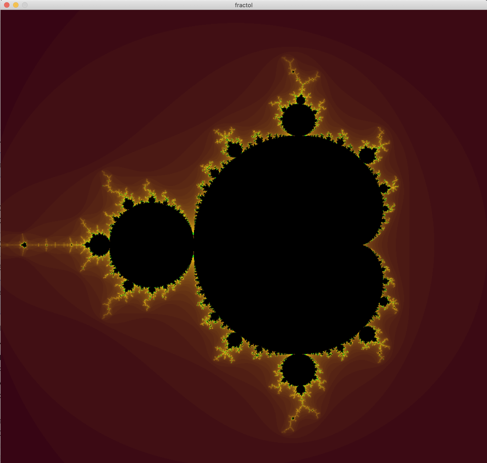

# fract-ol

## **Description**

As 42 school’s first graphical software project, fract-ol is designed to generate fractal images with a self-replicating zoom. It uses complex number calculations to create patterns that repeat across different scales allowing to zoom almost endlessly. The project was developed using the MiniLibX graphical library. 

## **Completion Status**

- Date: 28/08/2023
- Grade: 125/100

## **System Requirements**

This project has been tested and optimized for MacOS systems using minilibx for MacOS and OpenGL. Minor adjustments may be needed to run it on different machines.

## **Execution Guide**

After compiling with **`make`** , run the software with a specified fractal type:

```bash

./[Executable Name] <Fractal Type> [Optional Parameters]
```

Supported fractal set types include :

Mandelbrot, Julia, Burning Ship.

**Example :**

```bash
./fractol Mandelbrot  #launch a Mandelbrot set
./fractol Mandelbrot 4 #launch a Mandelbrot set with specialized colour
./fractol Julia 3 4  #lauch a Julia set so color and set types are mandatory
```

## **User Controls**

- Navigation: Use Arrow Keys
- Zoom: **`Mouse Scroll`**
- Color Scheme: **`Right Mouse Click`**
- Exit: **`Esc`** key
